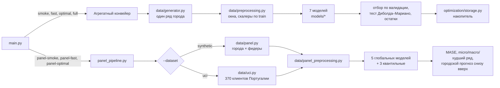

# Архитектура

Два конвейера с общей точкой входа `main.py`. Режим `--mode` определяет, какой
из них запускается.

## Модули

| Путь | Назначение |
|---|---|
| `main.py` | Разбор CLI, агрегатный конвейер, блок накопителя (`_run_storage_block`) |
| `panel_pipeline.py` | Многорядный конвейер, выбор источника данных, вероятностный блок |
| `config.py` | Режимы, сценарии, эталоны для России (`RealWorldReference`), экономика накопителя |
| `data/generator.py` | Синтетический ряд города: быт, промышленность, электротранспорт, солнце, погода, праздники |
| `data/panel.py` | Синтетическая панель: города, фидеры с разными параметрами, общая погода города |
| `data/uci.py` | Адаптер UCI ElectricityLoadDiagrams20112014: метки интервалов, переход на летнее время, отбор активных клиентов |
| `data/preprocessing.py` | Окна для агрегатного ряда, 26 признаков, скалеры только на train |
| `data/panel_preprocessing.py` | Окна внутри каждого ряда, три группы входов: история, известное будущее, статика |
| `models/baseline.py` | Наивные прогнозы, климатология, Ridge, XGBoost для агрегатного ряда |
| `models/lstm.py`, `models/transformer.py` | LSTM, VanillaTransformer, PatchTST |
| `models/dlinear.py` | DLinear: декомпозиция и линейные проекции |
| `models/panel_models.py`, `models/panel_trainer.py` | Глобальные модели для панели и их оценка |
| `models/quantile_models.py` | Квантильные модели P10/P50/P90 и функция потерь pinball |
| `models/trainer.py` | Обучение и оценка моделей агрегатного конвейера |
| `optimization/storage.py` | Симуляция накопителя: тарифы, КПД, деградация, стратегии, перебор порога |
| `analysis/` | Анализ данных, остатки, устойчивость и walk-forward |
| `utils/metrics.py` | MAE, MASE, sMAPE, тест Диболда–Мариано |
| `utils/quantile_metrics.py`, `utils/conformal.py` | Оценка квантилей и конформные интервалы |
| `utils/reporting.py` | Каталоги прогонов, метаданные, экспорт CSV/JSON/Markdown |
| `utils/deployment.py` | Бандлы моделей и прогноз по сохранённой модели |
| `experiments/transformer_ablation.py` | Ablation трансформеров, в полном объёме не запускался |

## Контракт данных панели

Длинный формат: одна строка на пару «момент времени × ряд».

- Обязательные колонки: `timestamp`, `city_id`, `feeder_id`, `consumption`, `hour`, `weekday`, `is_holiday`, `day_of_year`.
- Необязательные: погода, `ev_load_kw`, `solar_gen_kw`, `dsr_active`, колонки `static_*`.
- Все ряды лежат на общей временной сетке одной длины: границы сплитов задаются по времени, одинаково для всех рядов.
- Потребление всегда занимает нулевой канал истории. Модели дополнительно находят его по имени.

## Инварианты

Каждый закреплён тестами.

- Разбиение на train, val и test хронологическое. Скалеры обучаются только на train.
- Окна не пересекают границы сплитов и границы рядов.
- В признаки будущего попадает только прогноз погоды с растущей ошибкой, фактическая будущая погода — никогда.
- Лучшая модель и порог накопителя выбираются по валидации.
- Тест Диболда–Мариано считается по непересекающимся суткам.
- Один сид даёт побитово одинаковые данные в разных процессах: потоки случайности выводятся через `SeedSequence`, а не через `hash()`.
- Шаг прореживания окон взаимно прост с 24 и 168.
- Календарные признаки берутся из фактических дат, а не из остатка от деления.

## Артефакты прогона

Каждый прогон пишет в свой каталог `results/runs/<дата>_<время>_<режим>[_uci]_<сценарий>_seed<N>/`. Суффикс `_uci` появляется у прогонов на реальных данных:

| Файл | Содержимое |
|---|---|
| `run_metadata.json` | Режим, источник данных, сид, размеры сплитов, модели, коммит git, окружение, `status` |
| `metrics.csv`, `metrics.json` | Метрики каждой модели на test и val; ключ строки — модель, режим, источник данных, сценарий, сид, сплит |
| `metrics_by_horizon.csv` | Ошибка по шагам горизонта (агрегатный режим) |
| `diebold_mariano.csv` | Попарные тесты значимости (агрегатный режим) |
| `storage_forecast_value.csv` | Экономика накопителя по источникам прогноза, включая оптимум при известном будущем |
| `storage_threshold_sweep.csv` | Перебор порога накопителя на тесте (агрегатный режим) |
| `forecast_series_test.csv`, `forecast_series_val.csv` | Прогнозный и фактический ряды с отметками времени для офлайн-опытов с политикой накопителя |
| `walk_forward.csv` | Итоги по каждой точке отсечения (с `--rolling-origin N`) |
| `metrics_by_series.csv`, `metrics_by_city.csv` | Метрики по рядам и городам (panel) |
| `quantile_metrics.csv` | Вероятностные метрики (panel с `--probabilistic`) |
| `plots/` | Графики |
| `models/` | Агрегатный режим — бандл лучшей модели; panel — все обученные модели (`*.keras`, `*.pkl`), `preprocessing.pkl` с нормировщиками и `manifest.json` |

Статусы прогона:

| `status` | Значение | Код возврата |
|---|---|---|
| `running` | Прогон идёт, либо процесс был убит извне | — |
| `completed` | Все запрошенные модели и блоки отработали | 0 |
| `partial` | Отказала часть моделей или необязательных блоков; причины в `failed_models`, `failed_blocks`, `failed_quantile_models` | 2 |
| `failed` | Исключение или отказ основного пути; текст в `error` | 1 |

Статус выставляет `reporting.run_with_status` при запуске через `python main.py`. Метрики пишутся сразу после оценки на тесте, до графиков, бэктестинга и экономики: отказ этих блоков их не уничтожает.

Сводные `results/metrics.csv` и `metrics_by_seed.csv` в корне накапливают строки всех прогонов. Строки, записанные до 28.09.2026, не имеют источника данных. Файлы `storage_threshold_sweep.csv` и `forecast_series_*.csv` в корне остались от старых прогонов и больше не обновляются.
